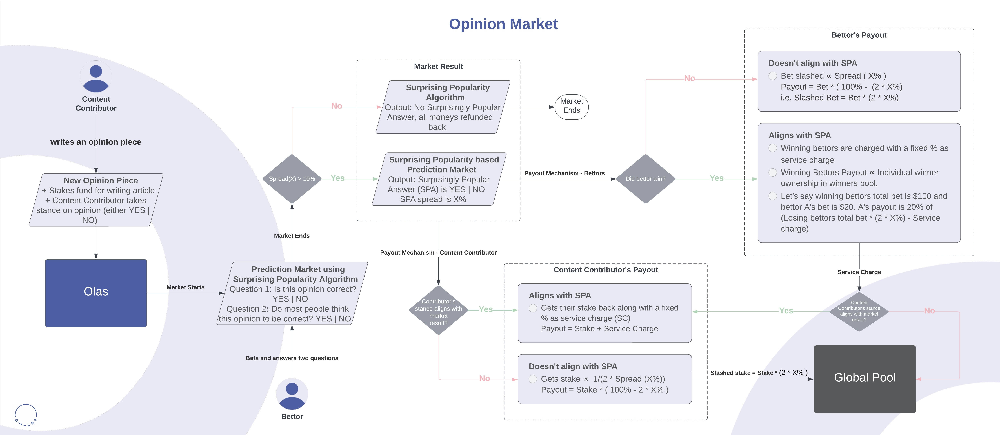

# Opinion Markets

The Opinion Markets within Olas serve as a platform where contributors offer diverse opinions and predictions on various subjects. The great weakness of traditional prediction markets in this sector is that bettors are more incentivised to bet on what they believe the majority believes to be true rather than what they know to be true themselves. This biases outcomes to popularly held but incorrect beliefs.&#x20;

The **Bayesian Truth Serum (BTS) algorithm** was specifically designed to remedy this bias. Olas employs this algorithm via the article tipping/commenting system and implements a specially designed market on top of it to reward contrarians that believe they hold correct but unpopular beliefs. If it turns out that there are others that share this position in greater numbers than alternative possibilities, they will be rewarded. The market will provide a signal to everyone else that this 'surprisingly popular' answer is likely to be the most insightful.&#x20;

The BTS algorithm works using on a dual-questioning approach, pairing factual queries with predictions of popular opinions. This removes the disincentive to bet that's found in a vanilla prediction market as people can bet both on what they believe to be true and what they believe others think to be true. Not only does it remove the disincentive involved when one holds what they believe to be an unpopular opinion, but it introduces a profit incentive by betting on one's true beliefs because those that bet thinking that they are in the majority actually provide a subsidy to those that know both the majority opinion _and_ the most truthful/accurate one.&#x20;

Here is an overview of how it the opinion markets work:

<figure><figcaption>
Figure : Olas Opinion Market
</figcaption></figure>

Each opinion piece poses a factual question (Q) paired with a popular opinion question (P) related to the topic ( **Question Formulation** ). Bettors respond to Q and P with bets, staking funds on their beliefs and predictions. BTS evaluates discrepancies between responses to Q and P, identifying the Surprisingly Popular Answer (SPA).

#### Discrepancy in the BTS Method:

In the context of the BTS methodology within Olas, the discrepancy represents the difference or variance between two sets of responses. The discrepancy calculation involves comparing the percentage of participants who responded to the factual question (either "Yes" or "No") with the percentage of participants who predicted what they believe most people will respond to the same question.

Example**:**

* If 60% of participants responded "Yes" to the factual question, but 70% predicted that most people would respond "Yes," the discrepancy for "Yes" would be -10% (60% - 70% = -10%).
* Similarly, if 40% responded "No" to the factual question, but 30% predicted that most people would respond "No," the discrepancy for "No" would be +10% (40% - 30% = +10%).

The discrepancies highlight the difference between participants' actual responses and their predictions regarding the collective opinion. This variance is crucial in identifying the SPA, which is the response with the larger discrepancy, as it signifies an unexpected or contrary view compared to popular expectation.

## Formulas for Payout Calculations

**Alignment in the Opinion Market:**

* **Participant Alignment:** When a participant's response aligns with the Surprisingly Popular Answer (SPA) for the factual question (Q).
* **Content Contributor Alignment:** Indicates alignment when a content contributor's stance in the opinion piece aligns with the Surprisingly Popular Answer.

**Discrepancy Calculation:**

$$\boxed{  D_y \, = \, Q_y \, - P_y \,}$$

$$D_y =$$ Discrepancy for YES response\
$$Q_y \,$$is the percentage of participants who voted "YES" for Q\
$$P_y$$ is the percentage of participants who voted "YES" for P\

$$\boxed{ D_n \, = \, Q_n \, - \, P_n \,}$$\
$$D_n =$$ Discrepancy for NO response\
$$Q_n$$ is the percentage of participants who voted "NO" for Q\
$$P_n$$ is the percentage of participants who voted "NO" for P

$$\boxed{  Spread \, ( \, X\% \, ) \, = \, |D_y| \, + \, |D_n| }$$

**Spread (X%)** is the sum of the absolute value of discrepancy for Yes and the absolute value of discrepancy for No.\

#### **Contributor/Olas Fee**

All winning bettors are taxed a certain percentage (TBD). Depending on which side wins, the contributor's opinion of those betting against it, this tax will be paid to the contributor or the Olas global pool. This is to reward contributors for submitting a good opinion that was validated by the market or, in the case of the opinion being found to be wrong by the market, to provide Olas with funds to fund better opinions in the future.&#x20;

### 1: **Bettor** Payout Calculations

\
$$\boxed{ Payout = B_i \, - \, L_i \, + \, P_i }$$\
\
$$B_i \, = \, Individual \,\, bet, \, i \, \in \, Bettors$$\
$$L_i \, = \, Bettor's \,\, loss, \, \forall \, i \, \notin \, SPA$$\
$$P_i \, = \, Bettor's \,\, profit, \, \forall \, i \, \in \, SPA$$

*   #### **Bettor Not Aligned with SPA (Non-Aligned):**

    \
    $$\boxed{ L_i \, = \, \mathbf B_\mathbf i \, \times \, ( \, 2 \, \times  X\% \, ) \, , \, \forall \, X \, \geqslant \, 50\% \, Bettors \, lose \, 100\% \, \, of \, their \, bet }$$\
    \
    $$L_i : \, Individual \, bettor's \, loss$$\
    \
    $$\displaystyle\sum_{i=0}^n L_i \, = \, All \, losing \, bettor's \, total \, loss$$\
    \
    $$B_i : Losing \, Better , \, \forall \, i \, \notin \, SPA$$\

Spread is capped at 50%, an SPA determined with spread (X%) will penalize bettors to lose their bets by 100%.\
_Total funds for winners = All losing Bettor’s total Loss_

*   #### **Bettor Aligned with SPA**

    \
    $$\boxed{  P \, = \, \Biggr( \dfrac{ B}{\displaystyle\sum_{j=0}^n \, B_j}  \Biggr) \,  \times \, \Biggr( \, \,   \displaystyle\sum_{i=0}^n L_i  \, - \, Service \, charge \, \Biggr) }$$\
    \
    $$P \, = \, Individual \, bettor's \, profit$$\
    $$B \, : \, Individual \, bet$$\
    \
    $$\displaystyle\sum_{j=0}^n \, B_j \, : \, Sum \, of \, all \, winning \, bettor's \,  bet$$\
    \
    $$\displaystyle\sum_{i=0}^n L_i \, = \, All \, losing \, bettor's \, total \, loss$$

### 2: Content Contributor Payout Calculations

* When the **content** **contributor's stance aligns** with the SPA, they get their stake back and service charge.\
  \
  $$\boxed{ Payout \, = \, S_i \, + \,  Service \, Charge }$$\
  $$S_i \, = \, Content \, Contributor's \, stake$$\

* When the **content contributor's stance doesn't align** with the SPA:\
  \
  $$\boxed{ Payout \, = \, S_i \, \times \, ( 100\% - 2 \times X\%), \,  \forall  \, X \, \geqslant 50\% \, Content \, Contributor \, loses \,  100\% \, of \, their \, stake }$$\
  $$2 \, \times \, X \% \, \, is \, capped \, at \, 100 \%$$\
  $$S_i \, = \, Content  \, Content's \, stake$$\
  $$Note : Slashed \, stake \, and \, service \, charge \, will \, go \, to \, OLAS \, global \, pool.$$

## Example illustrating payout calculations&#x20;

Let's consider the following scenario:

* **Factual Question (Q):** Will quantum computing become commercially viable for general consumer use by 2030?
* **Popular Opinion Question (P):** What do you think most people will respond to the question regarding quantum computing's commercial viability by 2030?

**Participants and Their Bets:**

| Bettor | Stake | Q's response | P's response |
| ------ | ----- | ------------ | ------------ |
| A      | $50   | Yes          | Yes          |
| B      | $30   | No           | No           |
| C      | $40   | Yes          | No           |
| D      | $20   | No           | Yes          |
| E      | $60   | Yes          | Yes          |
| F      | $100  | Yes          | No           |

**Content Contributor:**

* Content Contributor J: Stakes $500 on the opinion piece, stating "Quantum computing will not be commercially viable for general consumer use by 2030".

**Calculation of Responses:**

* Participants' Response to Q:\
  \- Yes: ( 66.67% )\
  \- No: ( 33.33% )
* Participants' Response to P:\
  \- Yes: ( 50% )\
  \- No: ( 50% )

**Surprisingly Popular Answer (SPA) Calculation:**

* Discrepancy for Yes: 66.67% (Q) - 50% (P) = +16.67%
* Discrepancy for No: 33.33% (Q) - 50% (P) = -16.67%
* Spread ( X% ) = $$|D_y| \, + \, |D_n|$$ = 33.34%
* SPA: Yes ( +16.67% > -16.67%)

#### **Calculating Payouts:**


Bettor’s Loss = $$L_i \, = \, \mathbf B_\mathbf i \, \times \, ( \, 2 \, \times  X\% \, ) \, , \, \forall \, X \, \geqslant \, 50\% \, Bettors \, lose \, 100\% \, \, of \, their \, bet$$\
Total funds for winners = Losing Bettor’s Loss = Losing Side Total Bets \* (2 \* X% )


Losing Bettor’s Loss = ($30 + $20) \* ( 2\* 33.34%)\
\=> $33.34

Total funds for winners = $33.34

Service charge = 10% \* 33.34 ( Assuming SC% = 10%) = $3.334\
\
Total funds for winners - Service Charge = 33.34 - 3.334 = $ 30.006

<table data-full-width="true"><thead><tr><th width="97">Bettor</th><th width="77">Stake</th><th width="171">Loss = bet*(2*X%)</th><th width="486.25">Profit = ( Bet / Total Bets by Winners) * ( Total funds for winners - Service Charge )</th><th>Payout</th></tr></thead><tbody><tr><td>A</td><td>$50</td><td>0</td><td>( 50/250 ) * 30.006 = $6.002</td><td>$56.002</td></tr><tr><td>B</td><td>$30</td><td>30 * (2 * 33.34% ) = $20.004</td><td>0</td><td>$9.996</td></tr><tr><td>C</td><td>$40</td><td>0</td><td>( 40/250 ) * 30.006 = $4.80096</td><td>$44.80096</td></tr><tr><td>D</td><td>$20</td><td>$13.336</td><td>0</td><td>$6.664</td></tr><tr><td>E</td><td>$60</td><td>0</td><td>( 60/250 ) * 30.006 = $7.20144</td><td>$67.20144</td></tr><tr><td>F</td><td>$100</td><td>0</td><td>( 100/250 ) * 30.006 = $12.0024</td><td>$112.0024</td></tr></tbody></table>


When content contributor's stance doesn't align with SPA, they get penalized $$\propto 2 \times Spread$$


**Now, the Content contributor's** initial stance to **(Q):** "Will quantum computing become commercially viable for general consumer use by 2030?" was No.\
Their payout would be:

**Payout:** Stake (S) \* (100% - (2 \* X% ))

\=> 500 \* ( 100% - 2\* 33.34%)\
\=> 500 \* ( 100% - 66.68% )\
\=> 500 \* 33.32%\
\=> $166.6


When content contributor's stance aligns with SPA, they get the whole stake along with the service charge.


Let's assume their initial stance to **(Q):** "Will quantum computing become commercially viable for general consumer use by 2030?" would have been 'Yes'.\
\
Their payout would have been: \
**Payout**: Stake (S) + (SC% of Winning Bettor's Profit)

\=> 500 + 3.334\
\=> $503.334
