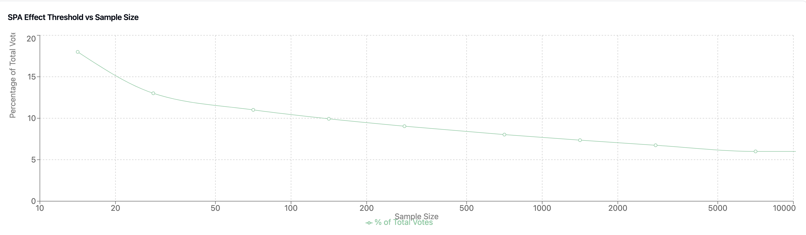

# Opinion Markets

The Opinion Markets within Olas serve as a platform where contributors offer diverse opinions and predictions on various subjects. The great weakness of traditional prediction markets in this sector is that bettors are more incentivised to bet on what they believe the majority believes to be true rather than what they know to be true themselves. This biases outcomes to popularly held but incorrect beliefs.&#x20;

The **Bayesian Truth Serum (BTS) algorithm** was specifically designed to remedy this bias. Olas employs this algorithm via the article tipping/commenting system and implements a specially designed market on top of it to reward contrarians that believe they hold correct but unpopular beliefs. If it turns out that there are others that share this position in greater numbers than alternative possibilities - the market will provide a signal to everyone else that this 'surprisingly popular' answer is likely to be the most insightful.&#x20;

The BTS algorithm works using on a dual-questioning approach, pairing factual queries with predictions of popular opinions.

Here is an overview of how it the opinion markets work:

<figure><figcaption>
Olas Opinion Market
</figcaption></figure>

Each opinion piece poses a factual question (Q) paired with a popular opinion question (P) related to the topic ( **Question Formulation** ). Tippers respond to question Q and P with tips and voice their opinions. BTS evaluates discrepancies between responses to Q and P, identifying the Surprisingly Popular Answer (SPA).

#### Discrepancy in the BTS Method:

In the context of the BTS methodology within Olas, the discrepancy represents the difference or variance between two sets of responses. The discrepancy calculation involves comparing the percentage of participants who responded to the factual question (either "Yes" or "No") with the percentage of participants who predicted what they believe most people will respond to the same question.

Example**:**

* If 60% of participants responded "Yes" to the factual question, but 70% predicted that most people would respond "Yes," the discrepancy for "Yes" would be -10% (60% - 70% = -10%).
* Similarly, if 40% responded "No" to the factual question, but 30% predicted that most people would respond "No," the discrepancy for "No" would be +10% (40% - 30% = +10%).

The discrepancies highlight the difference between participants' actual responses and their predictions regarding the collective opinion. This variance is crucial in identifying the SPA, which is the response with the larger discrepancy, as it signifies an unexpected or contrary view compared to popular expectation.

#### Market Outcome:

Once the market is settled, there can be 2 outcomes - **Popular Answer (PA)** or **Surprisingly Popular Answer (SPA).** PA occurs when there are not enough contrarian opinions on the other hand SPA happens when there are enough contrarian opinions.\

In the both the cases, the Content Contributor is paid a payout depending on where the market stands (i.e. market share on writer's side).

## Payout Mechanisms

### Deciding Market Outcome

Once market expires and is ready to settle, we calculate the SPA strength (s) and dynamic threshold (t)  to determine if an SPA exists or not.

#### **Discrepancy Calculation:**

$$\boxed{  D_y \, = \, Q_y \, - P_y \,}$$

$$D_y =$$ Discrepancy for YES response\
$$Q_y \,$$is the percentage of participants who voted "YES" for Q\
$$P_y$$ is the percentage of participants who voted "YES" for P\

$$\boxed{ D_n \, = \, Q_n \, - \, P_n \,}$$\
$$D_n =$$ Discrepancy for NO response\
$$Q_n$$ is the percentage of participants who voted "NO" for Q\
$$P_n$$ is the percentage of participants who voted "NO" for P

$$\boxed{  Spread \, ( \, X\% \, ) \, = \, |D_y| \, + \, |D_n| }$$

**Spread (X%)** is the sum of the absolute value of discrepancy for Yes and the absolute value of discrepancy for No.

#### **Dynamic Threshold (t)**

**Dynamic Threshold** is a percentage value which helps us decide if an SPA exists or not. It is calculated using a logarithmic graph which takes into account the total number of participants in the market.

<figure><figcaption>
Dynamic Threshold
</figcaption></figure>

$$
t(n) = \begin{cases} 
    18 & \text{ if } n \leq 10 \\[1ex] 
    6 + 12 \cdot \left(1 - \left(\frac{\ln(n/10)}{\ln(500)}\right)^{0.4}\right) & \text{ if } 10 < n < 5000 \\[1ex] 
    6 & \text{ if } n \geq 5000 
\end{cases} \\

\begin{aligned}
\text{Where:} \\
& \bullet \ n \text{ is the sample size} \\
& \bullet \ t(n) \text{ is the threshold percentage of total votes required} \\
& \bullet \ \ln \text{ is the natural logarithm}
\end{aligned}
$$

### **When does the market resolve to an outcome of SPA ?**

If the SPA spread ratio (X%)  exists with a strength of greater than or equal to dynamic threshold (t), we say that SPA exists.

$$
if( X ≥ t) \ \text{SPA exists} \\

\begin{aligned} \\
\text{where:} \\
& \bullet \text{ X is the SPA spread ratios} \\
& \bullet \ \text{t is dynamic threshold} \\
\end{aligned}
$$

### **Surprisingly Popular Answer (SPA) Payout Mechanism**

<figure><figcaption>
SPA Payout Curve
</figcaption></figure>

#### **SPA Strength (s)**

SPA Strength (s) is SPA spread (X%) capped to a limit of **t to 2.5t.**

$$
\text{s}(X, t) = \min\left(2.5 \cdot t, \max\left(t, \text{X}\right)\right) \\

\begin{aligned} \\
\text{where:} \\
& \bullet \ t \text{ is the threshold} \\
& \bullet \ \text{X is the SPA spread} \\
\end{aligned}
$$

#### **SPA Influence (i)**

This is what decides how much of an influence SPA has on the market, it ranges from 0 to 1. 0 being 0% influence of SPA and 1 being 100% influence of SPA on the market.

$$
\text{i}(s, t) = (s-t)/1.5t \\

\begin{aligned} \\
\text{where:} \\
& \bullet \text { 0 ≤ i ≤ 1 } \\
& \bullet \ s \text{ is the SPA strength} \\
& \bullet \ \text{t is the SPA threshold percentage} \\
\end{aligned}
$$

#### **Curvature Factor (c)**

Decides the curvature of the curve

$$
c = 0.7 \cdot i \\

\begin{aligned} 
\text{where:} \
& \text {0 ≤ c ≤ 0.7} \\
\end{aligned}
$$

#### SPA Payout Percentage

This function takes into account the influence (i) (which is calculated using the SPA strength and threshold), the market share from writer's perspective and the curvature (decided via the influence) to come up with a percentage value that dictates how we payout the Content Contributor.\
\

$$
f(x, t, s) = \begin{cases} 
    0.5 + 0.5\cdot i 
    & \text{if } x = 0 \\[2ex]
    
    0.5 + 0.5\cdot i \cdot \left(1 - \left(\frac{x}{0.45}\right)^{\frac{1}{1-c}}\right)
    & \text{if } 0 < x < 0.45 \\[2ex]
    
    0.5
    & \text{if } 0.45 \leq x \leq 0.55 \\[2ex]
    
    0.5 - 0.5\cdot i \cdot \left(1 - \left(1 - \frac{x-0.55}{0.45}\right)^{\frac{1}{1-c}}\right)
    & \text{if } 0.55 < x < 1 \\[2ex]
    
    0.5 \cdot (1 - i)
    & \text{if } x = 1
\end{cases}\\

\begin{aligned} \\
\text{where:} \\
& \bullet \ x \text{ is the market share from writer's perspective} \\
& \bullet \text{ i is the SPA influence on market payout} \\
& \bullet \ c \text{ is the curvature}
\end{aligned}
$$

#### SPA Payout&#x20;

$$
Pspa = f(x,t,s) \cdot (T +  S) \\

\begin{aligned} \\
\text{where:} \\
& \bullet \text{f is the SPA Payout percentage} \\
& \bullet \text{x is the market share from writer's perspective} \\
& \bullet \text{T is the total tips received} \\
& \bullet \text{S is the writer's original stake}
\end{aligned}
$$

### **When does the market resolve to an outcome of PA?**

$$
if( X < t) \ \text{ PA exists} \\

\begin{aligned} \\
\text{where:} \\
& \bullet \text{ X is the SPA spread ratio} \\
& \bullet \ \text{t is dynamic threshold} \\
\end{aligned}
$$

### **Popular Answer (PA) Payout Mechanism**

$$
\begin{aligned}
\textbf{Parameters:} & \\
& \bullet \ x && \text{Market Share} && (0 \leq x \leq 1) \\
& \bullet \ T && \text{Total Tips} \\
& \bullet \ S_{\text{min}} && \text{Minimum Stake} \\
& \bullet \ S_{\text{max}} && \text{Maximum Stake} \\
& \bullet \ S && \text{Stake Amount} \\
& \bullet \ r && \text{Reputation Score} && (0\text{-}100) \\[2ex]
\textbf{Constants:} & \\
& \bullet \ c_{\text{low}} && = 0.85 && \text{(Curvature for } 0 \leq x < 0.45\text{)} \\
& \bullet \ c_{\text{high}} && = 0.65 && \text{(Curvature for } 0.55 < x \leq 1\text{)} \\
& \bullet \ p && = 0.3 && \text{(Stake power)} \\
& \bullet \ \alpha && = 0.7 && \text{(Low stake penalty factor)} \\
& \bullet \ m && = 0.03 && \text{(Middle curvature)} \\
& \bullet \ k && = 1 && \text{(High performance multiplier factor)}
\end{aligned}
$$

#### **PA Payout**

We calculate the payout for popular answer by using a base curve which is influenced by various multipliers and penalties explained below.

$$
Ppa(x, T, S, r) = \min\left(T,
   \left(\frac{B(x)}{F(T, S)} \cdot L(x, T, S) \cdot H(x, S)\right) \cdot R(r, \text{Potential_Max_Payout})
\right)
$$

#### **Base Payout B(x)**

**This determines the base curve for the popular answer payout mechanism.**

<figure><figcaption>
PA Payout Curve
</figcaption></figure>

$$
B(x) = T \cdot \begin{cases}
    0.5 \cdot \left(\frac{x}{0.45}\right)^{2c_{\text{low}} + 1} 
    & \text{if } 0 \leq x < 0.45 \\[2ex]
    
    0.5 + (x - 0.5) \cdot m 
    & \text{if } 0.45 \leq x \leq 0.55 \\[2ex]
    
    1 - 0.5 \cdot \left(\frac{1-x}{0.45}\right)^{2c_{\text{high}} + 1} 
    & \text{if } 0.55 < x \leq 1
\end{cases}
$$

#### **Stake Factor F(T, S)**

Stake factor influences the base payout curve depending on the ratio of Tips to Stake throughout the spectrum.

$$
F(T, S) = \left(\frac{T}{S}\right)^p
$$

#### **Low Stake Penalty L(x, T, S)**

Penalizes for low stake when the market share is less than 45%.

$$
L(x, T, S) = \begin{cases}
   1 - \left(\frac{0.45 - x}{0.45}\right)^{\alpha} \cdot \left(1 - \frac{S}{T}\right)
   & \text{if } x < 0.45 \\[2ex]
   
   1 
   & \text{if } x \geq 0.45
\end{cases}
$$

#### **Reputation Multiplier R(r, Potential\_Max\_Payout)**

$$
R(r, \text{Potential\_Max\_Payout}) = 1 + \frac{r}{100} \cdot \frac{T - \text{Potential\_Max\_Payout}}{\text{Potential\_Max\_Payout}}
$$

We calculate the potential max payout, by assuming a market share of 100%

$$
\begin{aligned}
& \text{Potential\_Max\_Payout}(T, S, S_{\text{min}}, S_{\text{max}}) = \\
& = \min\left(T, \frac{B(x=1)}{F(T, S)} \cdot L(x=1,T,S) \cdot H(x=1, S)\right) \\[2ex]
& = \min\left(T, \frac{T}{F(T, S)} \cdot 1 \cdot H(x=1, S)\right) \\[2ex]
& = \min\left(T, \frac{T}{F(T, S)} \cdot H(x=1,S)\right)

\end{aligned}
$$

**Alignment in the Opinion Market:**

* **Participant Alignment:** When a participant's response aligns with the Surprisingly Popular Answer (SPA) for the factual question (Q).
* **Content Contributor Alignment:** Indicates alignment when a content contributor's stance in the opinion piece aligns with either the Popular Answer or Surprisingly Popular Answer.

#### **Olas Global Pool Fee**

Any amount from Total Tips or Content Contributor's Stake not going to the Writer goes to the Olas Global Pool to fund better opinions in the future.&#x20;

